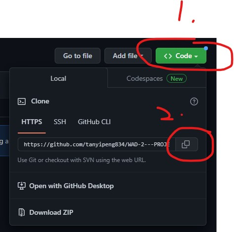

## 🤓 IS216 Project: StudySmart
* Group members:
* Lim Qi Qing (qiqing.lim.2021@scis.smu.edu.sg)
* Lee Chia Min Michelle (.2020@scis.smu.edu.sg)
* Tan Yi Peng (yipeng.tan.2021@scis.smu.edu.sg)
* Lim Si Yu(siyu.lim.2021@scis.smu.edu.sg)


## 🤓 Project Overview ##

**What is the problem?**

In Singapore, students are taught to study hard but not study smart. The root cause of the issue is that educational technology for secondary students are plentiful, but lacks in features to allow students to engage in self-directed studying. Most educational platforms like Student Learning Space (SLS) are only for teachers to disseminate lessons to students, and students are unable to utilise such a platform for their daily revision. Additionally, there lacks a shared collaborative space for homework help.

<br>

**How do we solve it?**

Introducing, Food-Ful, designed for anyone in the ages between 20-40 years old who are keen on reducing their food wastage. Our team has come up with a web application that aims to reduce food wastage - some features are for users to track the expiry date, and recommending recipes based on their inventory. 

<br>
<hr>
<br>

**Before Implementation**

Before the coding process, we came up with rough Figma design prototypes and a Web Navigation Diagram to give us a better idea on how our application will work.
<br><br>

**Below is our navigation diagram where we show the different functions and pages of our web application:**


<br><br>
**Below is our Architecture diagram to show the interactions between our application components:**


<br><br>

**To view our prototype, click on the links below:**
<br>

<ul>
  <li>iPad Pro Design:</li>
      https://www.figma.com/proto/rOnBkJ2nJiV2vXNKnXYVoE/WAD2-Project-wireframe?node-id=464%3A78&scaling=scale-down&page-id=459%3A19&starting-point-node-id=500%3A794&show-proto-sidebar=1
  <li>iPhone X Design:</li>
      https://www.figma.com/proto/rOnBkJ2nJiV2vXNKnXYVoE/WAD2-Project-wireframe?node-id=536%3A1542&scaling=scale-down&page-id=459%3A20&starting-point-node-id=536%3A1542&show-proto-sidebar=1
      
 </ul>


## 🤓 How to Install and Run Our Web Application (for Developers) ##
* This method is applicable to both Mac OS and Windows OS

### Firstly, you have to clone this repository into your local environment

1. On the '<> Code' page, click on the green 'code' button and a dropdown will appear.
2. Make sure you're under the 'HTTPS' tab, and copy the URL.



### Open git bash if you have it, otherwise any Command Line Interface that you use.

1. Change the current working directory to any location where you want the cloned repository to be - use command ```cd``` <path> to navigate
2. Type ```git clone```, and then paste the URL you copied earlier.

It should look something like this:


  
Press **Enter** to clone into your local machine
  
After cloning, change directory into the local repository
  


* Note that WAD2--PROJECT is the **root** folder, containing the main  **front-end** and **database**
  
### Now you have to install the node modules used in this repository
  
* Note that the screens below may defer from yours
  
1. Change directory into the front-end folder by using  ``` cd client```
2. Type ```npm install``` or ```npm i``` for short to install all the node modules used in the front-end folder


### You are done with the set-up! Now lets run our application on your localhost

1. Type ```npm run serve```  to start both the front and database together in your local server
  


2. Wait for around 10 to 20 seconds for the [webpack.Progress] to compile successfully
3. Click on http://localhost:8080/ to open our application locally
  


  


## 🤓 How to Use Our Web Application (for Visitors to our Website) ##

**1. The first page is the login page. Click on "Sign Up".**
<br>
<br>

<br>
<hr>
<br>

**2. Enter your details in the sign up page.**
<br>
<br>

<br>
<hr>
<br>
  
**3. You will now be brought to the dashboard. In the dashboard page, there will be a section that provides a radomly generated fun fact and button which redirects users to a page to view the headline news (this can only work locally as accessing the news API from the browser requires payment) There is also an examination countdown table where users can input their exams and its date. The table will compute and display the number of days left before the exam. If their exam is within 7 days, it will display a red backgroundand timetable feature which the student can utilise.**
  
<br>
  <br>

 <br><br>
<br>
<hr>
<br>
  
 **4. By pressing on "Read Latest News" button, you are brought to the news page with today's latest local news.**
  
<br>
  <br>
  
<br>
<hr>
  
<br>
  
 
**5. The timetable in the dashboard  is customisable where users drag and hold the desired time slot, a modal appears for them to input a certain activity during that timeframe. The users can input the subject and day that the selected time frame is for and colour in which they want the timetable section to be.**
  
   
<br>
  <br>
  
<br>
<hr>
  
<br>
  
  
**6. Users can use the sidebar (which can be expanded) to navigate between the pages**
  
<br>
  <br>
  

<br>
<hr>
  
  
<br>
  
**7. In the forum page, users can upload posts, like, unlike and comment on posts and filter the posts according to the selected filters. Users are also given the choice to delete their own posts.**
  
<br>
  <br>
  

<br>
<hr>
  
<br>  
  
**8. In the progress tracker page, users can input their test results for their different subjects. A line chart will be updated based on user input to show the user's academic progress.
The bar chart will also update to show the average score for each subject. Additionally, some analytics will be done and displayed for the user to keep track of which subject is their best, is the most consistent, and which they need to improve on.**
  
<br>
  <br>
  


<br>
<hr>
  
  
<br>
  
**9. For self-directed learning, the Quiz page provides users to DIY their own flashcards or multiple choice quiz**
  
<br>
  <br>
   


<br>
<hr>
  

<br>  
  
**10. To create a flashcard set, users have to click Flashcards and click the + button which redirects them to another page. In this page, users should input the relevant fields and can click + to add a new flashcard. Once done, they should click on Create New Deck.**
  
<br>  
  <br>
  

<br><br>
  

<br><br>


<br>
<hr>  
  
  
<br>
  
**11. To test themselves, users just need to select a previously created flashcard deck. Users will be presented the term/question and then need to click to flip the flashcard to view the answer. Further, users can user the next and back button to toggle between the flashcard and see their progress from the progress bar.**
  
<br>
  <br><br>
  

<br><br>
  
 <br><br>
  


<br>
<hr>
  
 <br>
  
  **12. Users have to input the quiz name, description and questions. For each question, users can generate as many options as they want and tick those that are the correct answer (there must be at least one correct answer).**
  
<br>
  <br><br>
  

<br><br>
  
 <br><br>
  


 <hr>

  **12. Users have to input the quiz name, description and questions. For each question, users can generate as many options as they want and tick those that are the correct answer (there must be at least one correct answer).**
  
 <br>
 <br>
 <br>
 <hr>

  

## 🤓 Forum ##
  Explore our Learn More page and get to know our roles and the goals of Food-Ful!


 


